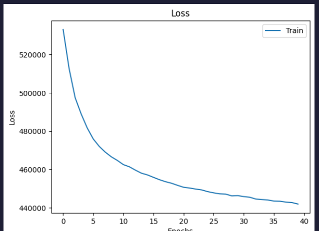

### model_new_no_norm 
vae = VAE(latent_dim=16, hidden_dim=256, x_dim=3072).to(device)
VAE(
  (encoder): Encoder(
    (fc_1): Linear(in_features=3072, out_features=2048, bias=True)
    (bn1): BatchNorm1d(2048, eps=1e-05, momentum=0.1, affine=True, track_running_stats=True)
    (fc_2): Linear(in_features=2048, out_features=1024, bias=True)
    (bn2): BatchNorm1d(1024, eps=1e-05, momentum=0.1, affine=True, track_running_stats=True)
    (fc_3): Linear(in_features=1024, out_features=256, bias=True)
    (bn3): BatchNorm1d(256, eps=1e-05, momentum=0.1, affine=True, track_running_stats=True)
    (LeakyReLU): LeakyReLU(negative_slope=0.2)
    (dropout): Dropout(p=0.1, inplace=False)
    (fc_mean): Linear(in_features=256, out_features=16, bias=True)
    (fc_var): Linear(in_features=256, out_features=16, bias=True)
  )
  (decoder): Decoder(
    (fc_1): Linear(in_features=16, out_features=256, bias=True)
    (bn1): BatchNorm1d(256, eps=1e-05, momentum=0.1, affine=True, track_running_stats=True)
    (fc_2): Linear(in_features=256, out_features=1024, bias=True)
    (bn2): BatchNorm1d(1024, eps=1e-05, momentum=0.1, affine=True, track_running_stats=True)
    (fc_3): Linear(in_features=1024, out_features=2048, bias=True)
    (bn3): BatchNorm1d(2048, eps=1e-05, momentum=0.1, affine=True, track_running_stats=True)
    (fc_5): Linear(in_features=2048, out_features=3072, bias=True)
    (LeakyReLU): LeakyReLU(negative_slope=0.2)
  )
)
fretchet_distance = 14.548020485690671

loss =  13840.035757211539,
L1 = 0.07947271683665573
learning curves:

